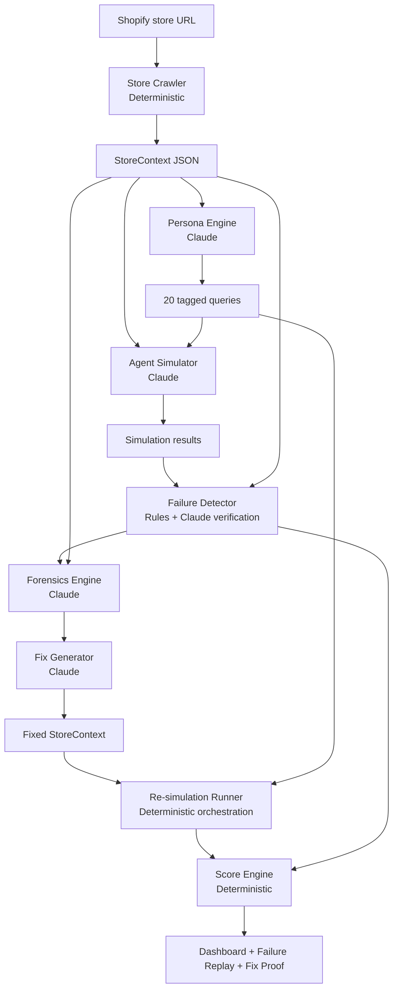

# APES Technical Document

## 1. Architecture Diagram



## 2. AI vs Deterministic Boundary Table

| Module | Boundary | Reason |
| --- | --- | --- |
| Store Crawler | Deterministic | Shopify data retrieval and normalization must be repeatable. Missing fields are facts, not model judgments. |
| Persona Engine | AI-powered | Natural shopping queries vary by persona, season, product type, and intent. Hardcoded queries would miss realistic phrasing. |
| Agent Simulator | AI-powered | The system needs language behavior from an AI shopping agent constrained to StoreContext. |
| Failure Detector | Deterministic + AI verification | Rule tags catch obvious refusal and hedging. Claude verifies whether the response is actually grounded in StoreContext. |
| Forensics Engine | AI-powered | Mapping a failed answer to the exact data gap requires semantic reasoning across products, policies, FAQs, and reviews. |
| Fix Generator | AI-powered | Rewriting merchant content requires language generation with persona and content-type awareness. |
| Re-simulation Runner | Deterministic | It reruns the same queries against fixed content and diffs classifications. |
| Score Engine | Deterministic | Scores must be auditable and stable from classification counts and weights. |

## 3. Why Each AI Call Is AI And Not Hardcoded Logic

Persona Engine: customer questions are not a finite checklist. The same missing shipping policy appears differently for a Gift Buyer, Budget Buyer, or Skeptic. Claude creates natural variance that static fixtures cannot cover.

Agent Simulator: APES needs to observe how an AI agent answers with limited context. A rules engine could label missing data but could not reproduce refusal, hedging, partial answers, or hallucination risk.

Failure Detector verification: deterministic signals are deliberately conservative. Claude checks whether a confident answer is supported by StoreContext, which is a semantic grounding task.

Forensics Engine: root cause analysis often requires connecting a question to an absent policy, an ambiguous product field, or missing trust evidence. This is language and context reasoning.

Fix Generator: merchant-ready fixes must be clear, specific, and complete. Claude can rewrite content for the failed persona and exact gap.

## 4. Failure Handling Strategy Per Module

Store Crawler: never throws on missing product fields. It records `StoreGap` entries with location, field, message, and severity. If live Shopify access fails, demo mode returns seeded StoreContext.

Persona Engine: wraps Claude calls in try/except. If Claude is unavailable or invalid JSON is returned, it falls back to 20 deterministic demo queries.

Agent Simulator: wraps Claude calls in try/except. If Claude fails, it returns an explicit uncertainty response rather than fabricating product facts.

Failure Detector: always runs rule-based pre-classification first. If Claude verification fails, it returns the rule classification with a lower confidence and explanatory reason.

Forensics Engine: wraps Claude calls in try/except. If Claude fails, it uses deterministic seeded root causes for demo mode.

Fix Generator: wraps Claude calls in try/except. If Claude fails, it returns deterministic repair copy that is still safe to show.

Re-simulation Runner: applies fixes to a copied StoreContext, preserving the original audit state for before/after comparison.

Score Engine: handles empty dimensions by assigning score `0` and never exposing stack traces to the frontend.

Frontend: hides raw JSON and stack traces. If the API is unavailable, it falls back to local demo data so the judging flow remains usable.

## 5. Data Flow From URL Input To Final Score

1. Next.js sends `{ store_url, demo_mode }` to `POST /audit`.
2. FastAPI `AuditPipeline` calls Store Crawler.
3. Store Crawler normalizes products, variants, images, metafields, policies, FAQs, collections, and gaps into `StoreContext`.
4. Persona Engine creates 20 tagged queries.
5. Agent Simulator answers each query using the exact system prompt and StoreContext.
6. Failure Detector stores response length, hedging, refusal, rule classification, Claude verification, confidence, and reason.
7. Forensics Engine creates one `ForensicFinding` for every non-CONFIDENT_CORRECT result.
8. Fix Generator creates one `FixProposal` per finding.
9. Re-simulation Runner applies fixes to a copied StoreContext and reruns the same queries.
10. Score Engine calculates before and after weighted scores:
    - Product Clarity: 30%
    - Policy Completeness: 25%
    - Trust Signals: 25%
    - FAQ Coverage: 20%
11. FastAPI returns a sanitized `AuditResult`.
12. Next.js renders dashboard, failure replay, fix comparison, and score delta.

## 6. Key Prompt Design Decisions And Why

Agent Simulator system prompt is intentionally strict:

```text
You are an AI shopping agent helping a customer.
You ONLY know what is in the store data below.
Do not make up specs, prices, or policies not mentioned.
If you are unsure about anything, say so explicitly.
Never hallucinate. Answer as if helping a real customer.
```

Why: the product is testing merchant representation, not general model knowledge. The agent must fail when StoreContext is incomplete.

Persona prompt asks for JSON array only.

Why: APES needs structured queries with persona, intent, expected answer type, difficulty, and dimension. JSON keeps the downstream simulation repeatable.

Failure verification prompt asks Claude whether the agent answered accurately based only on StoreContext.

Why: the rule layer catches obvious language signals, but hallucination detection requires semantic grounding against provided data.

Forensics prompt asks for exact location values such as `product:{id}`, `policy:{type}`, `faq`, or `general`.

Why: fixes need to map back to merchant-owned content. A vague diagnosis is not actionable.

Fix prompt includes content type, original content, identified gap, and persona.

Why: the output should be merchant-ready and targeted to the failed customer question, not generic copywriting.
